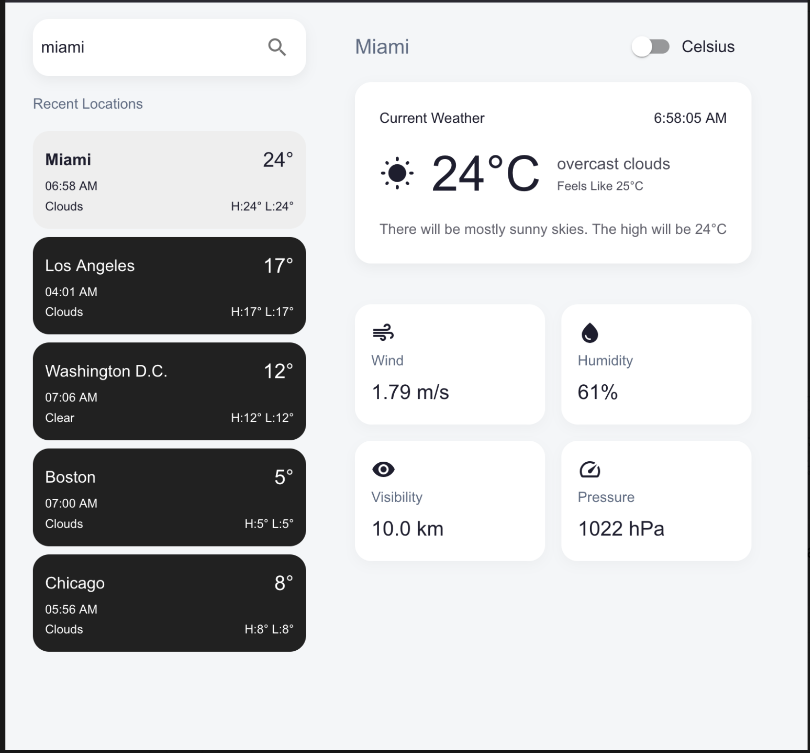
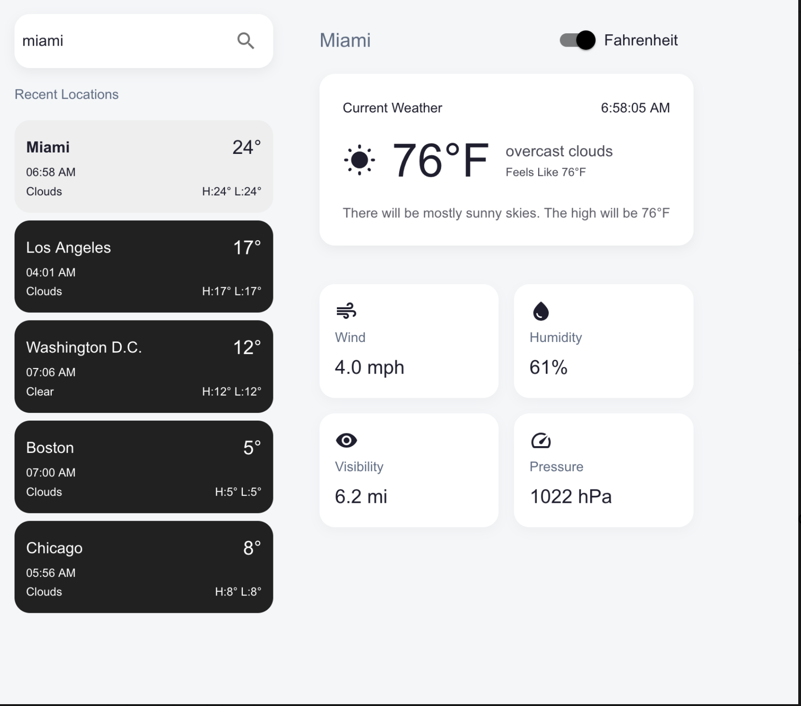

# 🌤️ Weather App

A modern weather application built with **Vite**, **React**, **TypeScript**, **Styled Components**, **Redux Toolkit**, and **TanStack Query**.  
It allows you to search for cities, view detailed weather information, switch between Celsius and Fahrenheit, and maintains a local history of recent searches using `redux-persist`.

---

## 📸 Screenshots

### 🌡️ Celsius Mode  


### 🌡️ Fahrenheit Mode  


---

## 🚀 Getting Started

### 1. Clone the repository

```bash
git clone https://github.com/your-username/weather-app.git
cd weather-app

2. Install dependencies
yarn

3. Create a .env file in the root of the project
VITE_OPENWEATHER_API_KEY=your_api_key_here

You can get a free API key from https://openweathermap.org/api

4. Start the development server
yarn dev

The app will be running at http://localhost:5173

⚙️ Tech Stack
  ⚡️ Vite

  ⚛️ React

  🔐 TypeScript

  💅 Styled Components

  📦 Redux Toolkit + Persist

  🔍 TanStack Query (React Query)

  💨 Material UI

  🔔 Notistack

🧩 Features
  🔍 Search for any city

  📊 Display current weather details

  🔄 Toggle between °C and °F

  💾 Persistent search history (last 5 locations)

  🧠 State management via Redux Toolkit

  🔔 Notifications on success or failure

  📱 Responsive design

🙌 Credits
Thanks to OpenWeatherMap for providing the weather data API.

Built with ❤️, ☕️, and lots of code.


